# Домашнее задание к занятию «Ansible.Часть 2»

---

### Задание 1

**Выполните действия, приложите файлы с плейбуками и вывод выполнения.**

Напишите три плейбука. При написании рекомендуем использовать текстовый редактор с подсветкой синтаксиса YAML.

Плейбуки должны: 

1. Скачать какой-либо архив, создать папку для распаковки и распаковать скаченный архив. Например, можете использовать [официальный сайт](https://kafka.apache.org/downloads) и зеркало Apache Kafka. При этом можно скачать как исходный код, так и бинарные файлы, запакованные в архив — в нашем задании не принципиально.
2. Установить пакет tuned из стандартного репозитория вашей ОС. Запустить его, как демон — конфигурационный файл systemd появится автоматически при установке. Добавить tuned в автозагрузку.
3. Изменить приветствие системы (motd) при входе на любое другое. Пожалуйста, в этом задании используйте переменную для задания приветствия. Переменную можно задавать любым удобным способом.

### Решение

1. Буду скачивать архив исходников по ссылке https://dlcdn.apache.org/kafka/4.0.0/kafka-4.0.0-src.tgz. Для этого создал такой [плейбук](task-1/playbook-1-1):
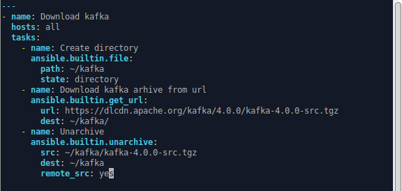

Запускаю
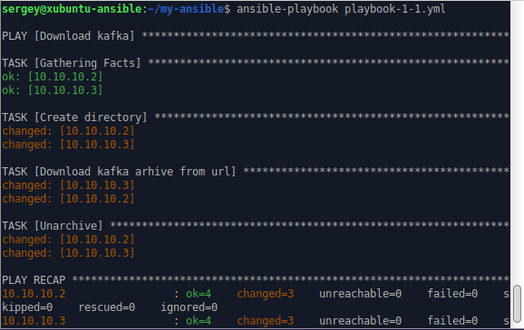

Проверяю
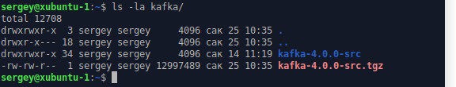

Другой вариант решения ([плейбук](task-1/playbook-1-2)) немного короче. Он использует возможность модуля unarchive скачивать файлы из интернета:
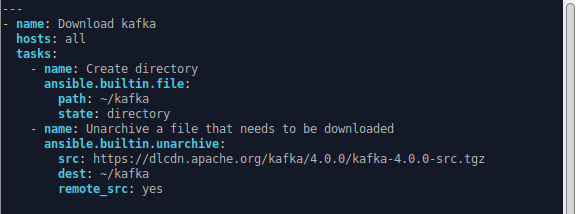

Запускаю
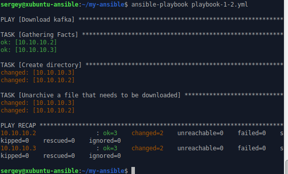

Проверяю
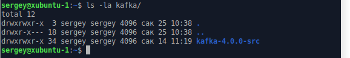

2. Для установки пакета tuned из стандартного репозитория написал такой [плейбук](task-1/playbook-2)
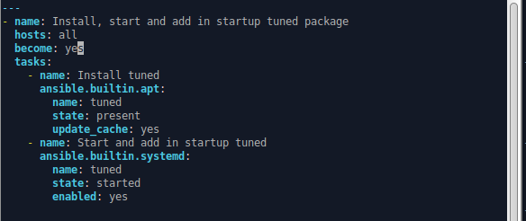

Запускаю
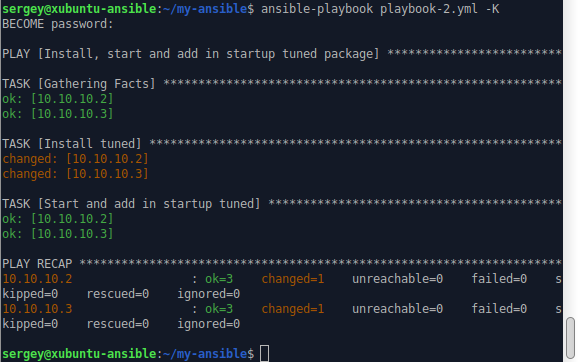

Проверяю
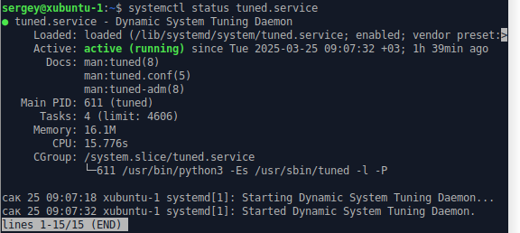

3. Для изменения приветствия системы добавлю файл 99-my-message в каталог /etc/update-motd.d/. Для этого
* создал [файл](task-1/message-script)
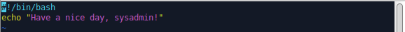

* создал [файл](task-1/variables.yml) с переменными (для практики работы с описанием переменных в файлах)
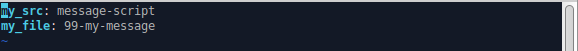

* и написал такой [плейбук](task-1/playbook-3) (ввёл ещё одну переменную в плейбуке)
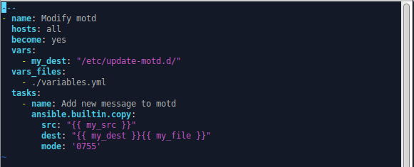

Запускаю
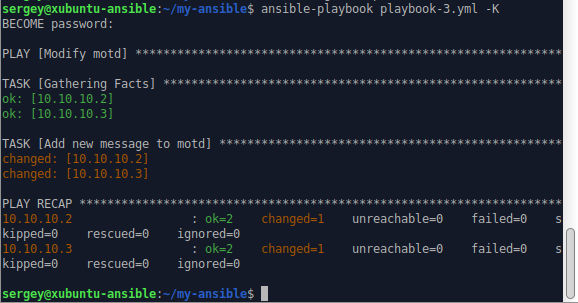

Проверяю
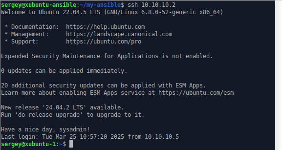

[Все файлы по первому заданию можно найти здесь](task-1/)

---

### Задание 2

**Выполните действия, приложите файлы с модифицированным плейбуком и вывод выполнения.** 

Модифицируйте плейбук из пункта 3, задания 1. В качестве приветствия он должен установить IP-адрес и hostname управляемого хоста, пожелание хорошего дня системному администратору. 

### Решение

---

### Задание 3

**Выполните действия, приложите архив с ролью и вывод выполнения.**

Ознакомьтесь со статьёй [«Ansible - это вам не bash»](https://habr.com/ru/post/494738/), сделайте соответствующие выводы и не используйте модули **shell** или **command** при выполнении задания.

Создайте плейбук, который будет включать в себя одну, созданную вами роль. Роль должна:

1. Установить веб-сервер Apache на управляемые хосты.
2. Сконфигурировать файл index.html c выводом характеристик каждого компьютера как веб-страницу по умолчанию для Apache. Необходимо включить CPU, RAM, величину первого HDD, IP-адрес.
Используйте [Ansible facts](https://docs.ansible.com/ansible/latest/playbook_guide/playbooks_vars_facts.html) и [jinja2-template](https://linuxways.net/centos/how-to-use-the-jinja2-template-in-ansible/). Необходимо реализовать handler: перезапуск Apache только в случае изменения файла конфигурации Apache.
4. Открыть порт 80, если необходимо, запустить сервер и добавить его в автозагрузку.
5. Сделать проверку доступности веб-сайта (ответ 200, модуль uri).

В качестве решения:
- предоставьте плейбук, использующий роль;
- разместите архив созданной роли у себя на Google диске и приложите ссылку на роль в своём решении;
- предоставьте скриншоты выполнения плейбука;
- предоставьте скриншот браузера, отображающего сконфигурированный index.html в качестве сайта.

### Решение
